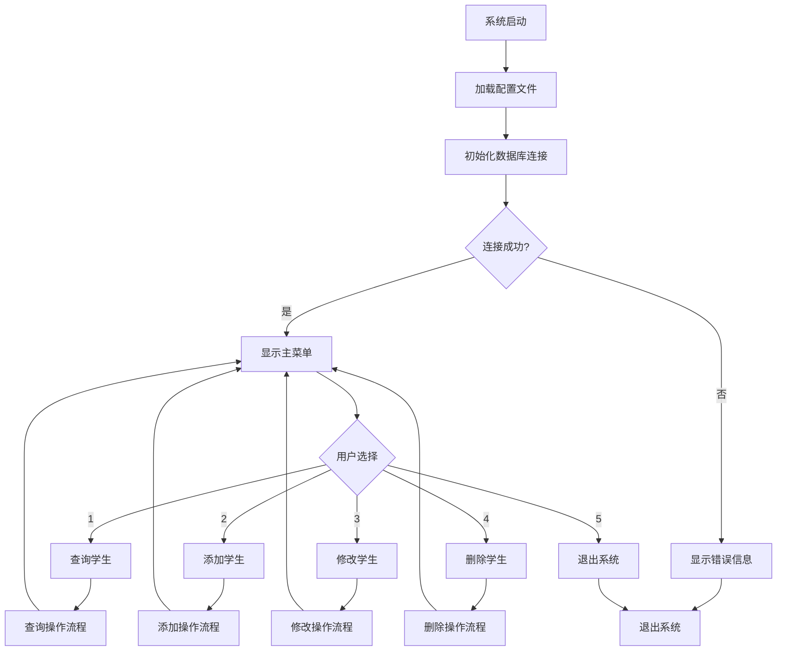
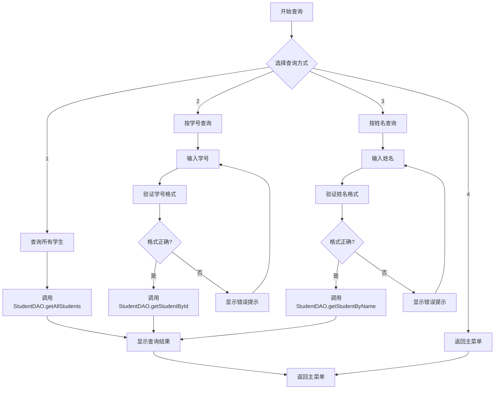
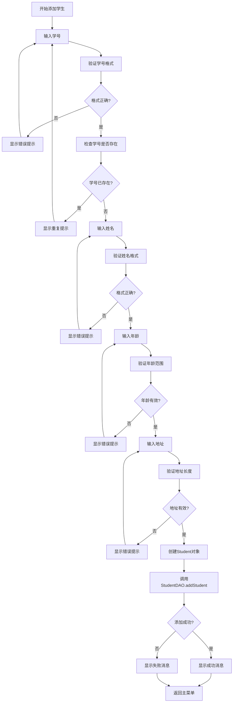
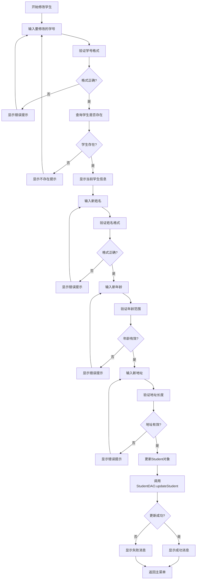
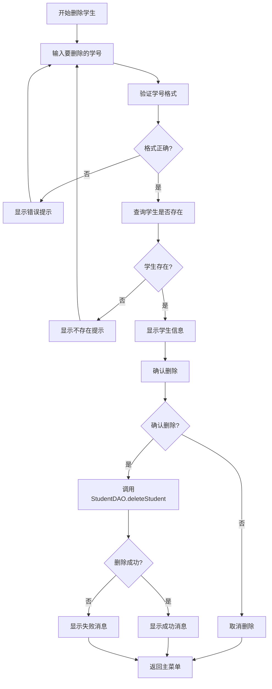
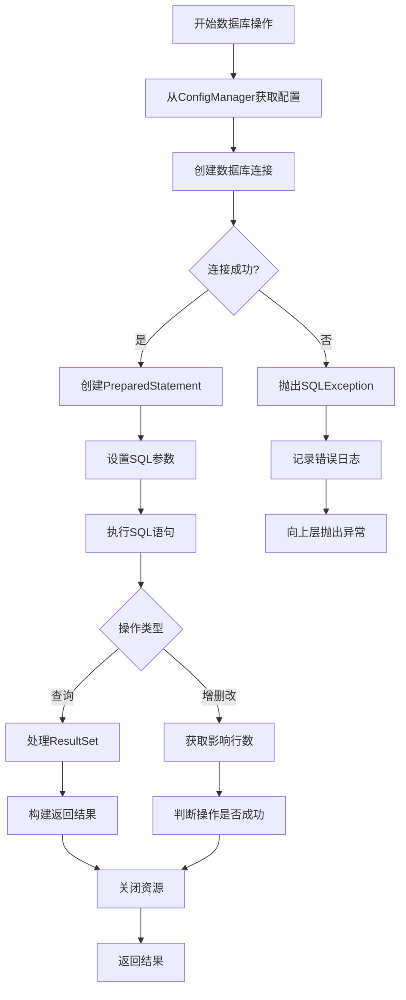
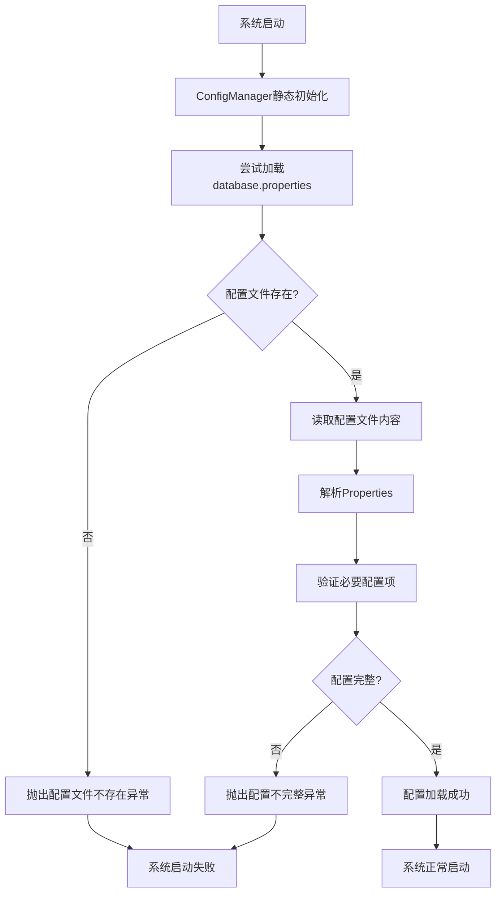
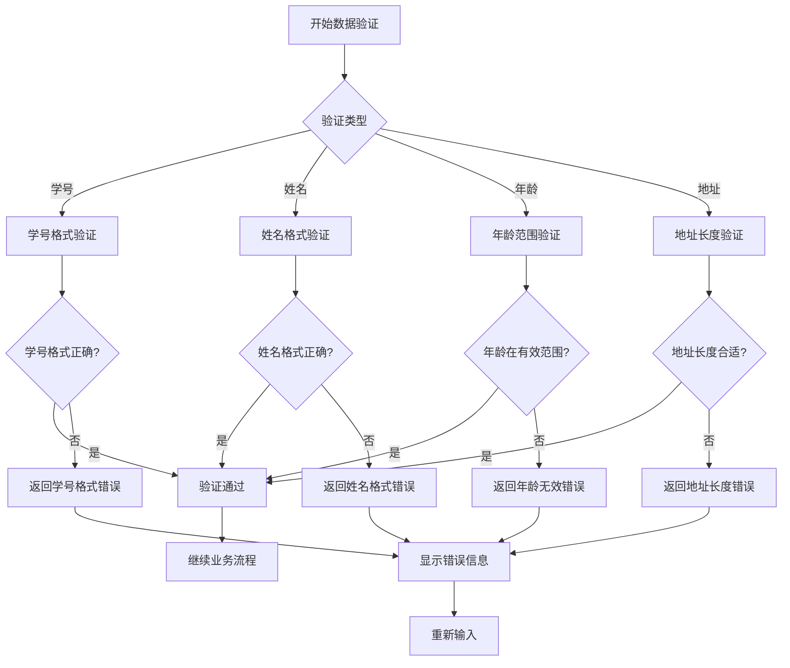

# 学生管理系统流程图

## 1. 系统整体流程图

## 2. 查询学生流程图

## 3. 添加学生流程图

## 4. 修改学生流程图

## 5. 删除学生流程图

## 6. 数据库操作流程图

## 7. 配置加载流程图

## 8. 数据验证流程图

## 使用说明

以上流程图使用Mermaid语法编写，可以在支持Mermaid的Markdown编辑器中查看，如：

- GitHub
- GitLab
- VS Code (安装Mermaid扩展)
- Typora
- 在线Mermaid编辑器

这些流程图详细展示了学生管理系统的各个业务流程，包括：

1. **系统整体流程** - 展示系统启动到退出的完整流程
2. **查询流程** - 展示各种查询操作的详细步骤
3. **添加流程** - 展示添加学生的完整验证和存储流程
4. **修改流程** - 展示修改学生信息的完整流程
5. **删除流程** - 展示删除学生的确认和执行流程
6. **数据库操作流程** - 展示底层数据库操作的通用流程
7. **配置加载流程** - 展示系统启动时配置文件的加载过程
8. **数据验证流程** - 展示各种数据验证的详细逻辑

这些流程图可以帮助理解系统的工作原理，也可以用于系统文档、培训材料或代码审查。
